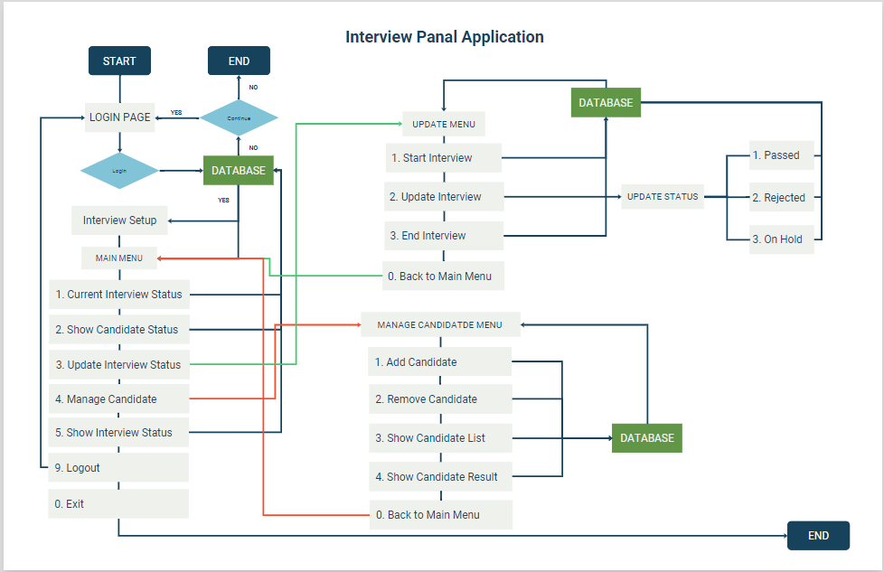
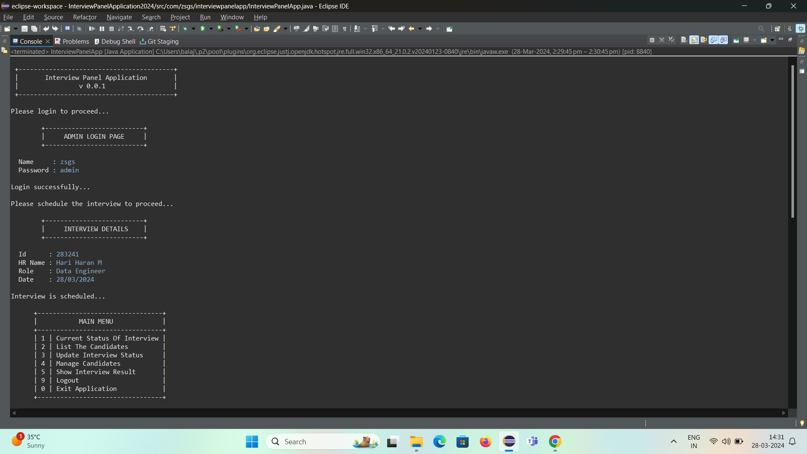
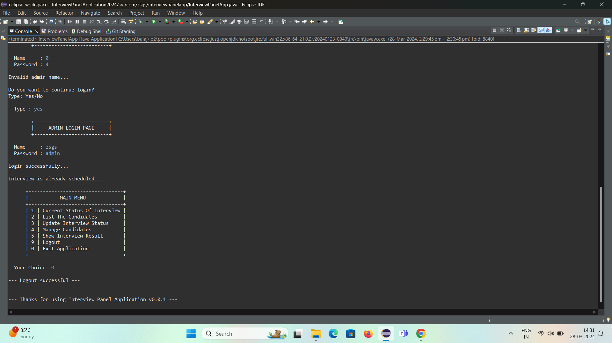

# Interview Panel Application

This application is designed to streamline the interview process by providing features for managing candidates to scheduling. 

## Features

- Admin User Login & Logout (session maintenance)
- Interview schedule with basic details
- Managing candidates
- Create and add candidate details
- Remove candidate’s details
- Update interview’s status 
- Update candidate’s status
- View candidate details 
- View candidate status
- View Interview details 
- View Interview status

## Flow Chart

## Developed Using

IDE: Eclipse

Language: Java
## Screenshots

